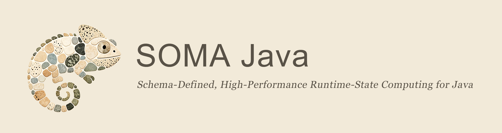

# SOMA Java

SOMA Java 是面向 Java 8 的 Schema-Defined、Compiler-Specialized、
JVM Heap-Resident 高性能运行时状态计算库。它服务于需要在单个进程内维护大量、
频繁变化状态，并围绕这些状态反复执行类型安全本地计算的 Java 应用。

Application 声明稳定的数据形态和访问路径；SOMA 在编译期生成领域化 API，并在
运行期提供 packed columnar storage、精确访问、typed transformation、受控并行与
显式资源边界。Application 继续拥有业务规则、event loop、I/O、跨表提交与恢复。

> 当前 V1 release candidate 坐标为 `1.0.0`。G0 已稳定；最终 clean candidate 的
> G1–G5 正在重放，selected private-source G6 仍 blocked。仓库尚未公开，也未发布
> 到 Maven Central。

## 为什么使用 SOMA

SOMA 面向这样的运行时状态：

- 数据结构稳定，但字段会被高频读取和更新；
- 既需要连续遍历，也需要按 Key、Unique 或 Index 精确缩小候选集；
- 计算通常遵循“选择候选、筛选、排序、聚合、关联、更新或导出”的局部流程；
- hot loop 不能由临时 row object、装箱集合、反射或隐藏的全表重建主导；
- 边界代码仍希望使用普通、类型安全的 Java 对象，而不是直接管理裸数组。

SOMA 不是通用 Collection、ORM、SQL/query engine、DataFrame、工作流引擎或分布式
计算平台。它是 application 内部由 schema 驱动的 runtime-state data plane。

## 工作方式

```text
annotation schema
    -> javac 8 plugin + annotation processor
    -> generated schema-specific Metadata / Table / Access / DataFlow API
    -> packed columnar runtime state
    -> Point / Candidate / Column / Key / Bulk / Ownership access
    -> Eager Detached result 或同步 callback-scoped delivery
```

用户从三个正交维度理解 SOMA：

| 维度 | 主要问题 | 核心抽象 |
|---|---|---|
| State / Owner | 谁拥有 live state，它如何组合和释放？ | `SomaGroup`、root Table、parent-owned child |
| Capability | 对状态允许执行哪些封闭、类型安全的操作？ | Schema/Metadata、Storage、Access、Mutation、Relation、Transformation、Execution、Result Delivery |
| Plan / Lifecycle | 配置何时可变，执行与观察何时产生？ | Descriptor、Builder、Effective Plan、Definition、Template、Invocation、Observation |

完整目标体验见 [SOMA Java 产品蓝图](docs/blueprints/soma-java-product-blueprint.md)；
规范性语义由 [Design](docs/design/README.md) 唯一拥有。

## 核心能力

| 能力 | 产品边界 | 深入阅读 |
|---|---|---|
| Schema 与生成 API | annotation schema 经编译期验证，生成 schema-specific facade | [Schema 与生成 API](docs/design/schema-and-generated-api.md) |
| Metadata、Plan 与 Ownership | payload 与 metadata 分离；create 前配置，freeze 后不可变；Group/parent 关闭生命周期 | [Runtime Plan 与可观测性](docs/design/runtime-plan-and-observability.md)、[Ownership](docs/design/ownership-and-lifecycle.md) |
| Storage 与 Access | packed columns、稳定 Key、current Index、增量 exact access 和 bounded bulk | [Table、存储与访问](docs/design/table-storage-and-access.md)、[Access Model](docs/design/access-model-and-candidate-scan.md) |
| Transformation 与 DataFlow | typed Shape/Operator、reusable Template、one-shot Invocation、safe-point Effect | [Transformation](docs/design/transformation-model.md)、[DataFlow](docs/design/dataflow-execution-model.md) |
| Resource、Failure 与 Result | 显式预算、结构化失败、Eager Detached 默认和受限 callback delivery | [性能模型](docs/design/performance-model.md)、[正确性与失败](docs/design/correctness-and-failure.md)、[Materialization](docs/design/materialization-boundary.md) |

V1 live schema field 只接受 primitive-backed scalar、白名单 `String`、
compiler-flattened `@SomaValue` 和 parent-owned child。普通 Java object、
`List`、`Map` 或任意 object graph 不进入 live storage。

## 快速开始

SOMA Java 当前唯一 compiler/runtime validation authority 是 Amazon Corretto
8.502.07.1 full JDK 8。下面的最小程序完成一个完整使用闭环：

```text
声明 Schema -> 编译生成类型安全 API -> 批量写入 -> 筛选 -> 原地更新
    -> detached 读取 -> 显式释放
```

### 1. 准备 SOMA artifact

macOS 可通过 Homebrew 安装：

```sh
brew install --cask corretto@8
export JAVA_HOME=$(/usr/libexec/java_home -v 1.8)
./scripts/check-toolchain.sh
```

当前 artifact 仍只来自 private repository 中的 `1.0.0` source candidate。在 SOMA
仓库根目录使用固定的 Maven Wrapper 将其安装到本机 Maven repository：

```sh
./mvnw -B -ntp install
```

### 2. 创建 Maven consumer

新建一个普通 Maven 项目，并使用以下完整 `pom.xml`。`soma-processor` 只参与
编译，不进入 application runtime graph。

```xml
<project xmlns="http://maven.apache.org/POM/4.0.0"
         xmlns:xsi="http://www.w3.org/2001/XMLSchema-instance"
         xsi:schemaLocation="http://maven.apache.org/POM/4.0.0 https://maven.apache.org/xsd/maven-4.0.0.xsd">
  <modelVersion>4.0.0</modelVersion>

  <groupId>com.example.soma</groupId>
  <artifactId>soma-quickstart</artifactId>
  <version>1.0.0-SNAPSHOT</version>

  <properties>
    <project.build.sourceEncoding>UTF-8</project.build.sourceEncoding>
    <maven.compiler.source>1.8</maven.compiler.source>
    <maven.compiler.target>1.8</maven.compiler.target>
    <soma.version>1.0.0</soma.version>
  </properties>

  <dependencies>
    <dependency>
      <groupId>io.github.somaruntime.soma</groupId>
      <artifactId>soma-annotations</artifactId>
      <version>${soma.version}</version>
    </dependency>
    <dependency>
      <groupId>io.github.somaruntime.soma</groupId>
      <artifactId>soma-runtime-core</artifactId>
      <version>${soma.version}</version>
    </dependency>
    <dependency>
      <groupId>io.github.somaruntime.soma</groupId>
      <artifactId>soma-dataflow</artifactId>
      <version>${soma.version}</version>
    </dependency>
    <dependency>
      <groupId>io.github.somaruntime.soma</groupId>
      <artifactId>soma-processor</artifactId>
      <version>${soma.version}</version>
      <scope>provided</scope>
    </dependency>
  </dependencies>

  <build>
    <plugins>
      <plugin>
        <groupId>org.apache.maven.plugins</groupId>
        <artifactId>maven-compiler-plugin</artifactId>
        <version>3.11.0</version>
        <configuration>
          <source>1.8</source>
          <target>1.8</target>
          <encoding>UTF-8</encoding>
          <compilerArgs>
            <arg>-Xplugin:SomaValue</arg>
          </compilerArgs>
          <annotationProcessorPaths>
            <path>
              <groupId>io.github.somaruntime.soma</groupId>
              <artifactId>soma-processor</artifactId>
              <version>${soma.version}</version>
            </path>
            <path>
              <groupId>io.github.somaruntime.soma</groupId>
              <artifactId>soma-annotations</artifactId>
              <version>${soma.version}</version>
            </path>
          </annotationProcessorPaths>
        </configuration>
      </plugin>
    </plugins>
  </build>
</project>
```

### 3. 声明 Schema

在 `src/main/java/com/example/soma/quickstart/package-info.java` 中声明 generated
API 的包：

```java
@SomaSchema(
        name = "quickstart",
        generatedPackage = "com.example.soma.quickstart.generated",
        version = "1")
package com.example.soma.quickstart;

import io.github.somaruntime.soma.annotation.SomaSchema;
```

在同一目录创建 `Particle.java`。这是 application 的 logical schema，不是
SOMA 的 live row storage：

```java
package com.example.soma.quickstart;

import io.github.somaruntime.soma.annotation.SomaField;
import io.github.somaruntime.soma.annotation.SomaTable;

@SomaTable(name = "Particle", defaultCapacity = 16)
public final class Particle {
    @SomaField public int id;
    @SomaField public long ticks;
    @SomaField public float x;

    public Particle() {
    }
}
```

### 4. 使用 generated API

创建 `QuickStart.java`。编译时 SOMA 会生成 `ParticleBatch` 和
`ParticleTable`，application 直接使用这些 schema-specific 类型：

```java
package com.example.soma.quickstart;

import com.example.soma.quickstart.generated.ParticleBatch;
import com.example.soma.quickstart.generated.ParticleTable;

public final class QuickStart {
    private QuickStart() {
    }

    public static void main(String[] args) {
        ParticleBatch batch = new ParticleBatch(3);
        batch.addValues(1, 10L, 1.5f);
        batch.addValues(2, 20L, 2.5f);
        batch.addValues(3, 30L, 3.5f);

        ParticleTable table = ParticleTable.create();
        try {
            table.addBatch(batch);

            long selected = table.filter(row -> row.ticks() >= 20L).count();
            table.mutateAt(0).setTicks(11L).commit();
            Particle first = table.fetchAt(0);

            System.out.println("rows=" + table.size()
                    + ", selected=" + selected
                    + ", first.ticks=" + first.ticks);
        } finally {
            table.release();
        }
    }
}
```

### 5. 编译并运行

在 consumer 项目根目录执行（示例使用 macOS/Linux classpath 语法）：

```sh
mvn -B -ntp clean compile \
  org.apache.maven.plugins:maven-dependency-plugin:3.8.1:build-classpath \
  -DincludeScope=runtime \
  -Dmdep.outputFile=target/runtime-classpath.txt

java -cp "target/classes:$(cat target/runtime-classpath.txt)" \
  com.example.soma.quickstart.QuickStart
```

预期输出：

```text
rows=3, selected=2, first.ticks=11
```

这段 Quick Start 已作为独立于 SOMA reactor 的 Maven consumer 实际编译和运行。
Key、Unique、Index、Group、RuntimePlan、typed DataFlow 与 String 等完整用法见
[Java 8 安装与 Maven consumer 指南](guides/java-v1-install-and-consumer-guide.md)；
可执行的外部 consumer coverage 位于
[`tests/fixtures/`](tests/fixtures/)。

## 使用 AI coding tools

V1 source 在
[`use-soma-java` Agent Skill](.agents/skills/use-soma-java/SKILL.md)
提供唯一 canonical 的 AI consumer workflow。它帮助工具完成 Maven/Schema 建模、
generated API 取证、Access/DataFlow 路由、lifecycle/resource 检查和真实 consumer
验证，但不重新定义 SOMA Design。

将下面提示词交给 AI coding tool；当前 repository 为 private 时，工具和用户都
必须已经拥有访问权：

> 从 SOMA Java 官方仓库 `somaruntime/soma-java` 获取当前 consumer 所用版本对应
> 的 release tag；若该 tag 尚不可用，只接受由我提供的 immutable commit SHA。
> 安装前先展示 source ref、`.agents/skills/use-soma-java/` 文件树、`SKILL.md`
> 内容摘要、`1.0.x` 兼容范围、目标 project-scoped Skill 目录和所需权限。不要
> 运行 bundled script、不要安装到全局目录、不要授予宽泛 Shell/Git/网络权限，
> 直到我确认。确认后按当前工具支持的 Agent Skills 方式复制完整目录并验证
> `use-soma-java` 可被发现；若不支持自动安装，给出等价的手动复制和验证步骤。
> 最后报告固定来源、目标路径、验证结果和限制。

首版 Skill 为 instruction-only，没有 bundled script 或宽泛 `allowed-tools`。
手动 fallback、project/global scope、升级和卸载边界见
[Consumer Guide](guides/java-v1-install-and-consumer-guide.md#3-ai-coding-tools-skill)。
未经过真实宿主发现、触发和行为验证的工具不作支持声明。

## 参考应用

三个相互独立的 Java 8 consumer 展示相同能力怎样进入不同 application boundary：

- [工业动态调度引擎](soma-examples/industrial-dynamic-scheduler/docs/README.md)：
  direct Access、Candidate Scan、增量 frontier 与 application-owned solver loop；
- [个体生态仿真](soma-examples/grassing-individual-simulation/docs/README.md)：
  packed 迭代状态、exact group、staged mutation 与确定性 lifecycle；
- [实时派工规则引擎](soma-examples/real-time-dispatch-rule-engine/docs/README.md)：
  reusable multi-source DataFlow、Join/GroupBy、受控并行与 detached command。

这些应用是普通 consumer evidence，不拥有 SOMA 产品语义，也不共享领域 runtime
或 testkit。

## 当前状态

| Gate | 状态 | 当前边界 |
|---|---|---|
| G0 | passed | Java-only产品边界、正式Owner、claim boundary与核心抽象叙事规则稳定 |
| G1–G4 | blocked | production Java surface未改变，但最终`1.0.0` clean candidate仍需canonical Full |
| G5 | blocked | 旧Corretto evidence只解释旧candidate；等待精确commit的DataFlow 3-fork与8-lane required qualification |
| G6 | blocked | 等待同一最终candidate的Full、package/security provenance、matrix与Owner sign-off |

当前结论允许继续受控形成V1候选，但不声明10M/100M guarantee、Linux性能/规模、
private-source ready、public release、Maven Central或production readiness。

最新事实从以下入口读取：

- [当前 Conformance](docs/conformance/current-conformance.md)
- [V1 release governance](reports/java-v1-release-governance-report.md)
- [性能与规模摘要](reports/current-performance-summary.md)
- [G6 release readiness](reports/java-v1-g6-release-readiness-report.md)

## 文档导航

| 我想要…… | 入口 |
|---|---|
| 理解 SOMA 的目标用户、目标形态和完整使用旅程 | [Blueprint](docs/blueprints/README.md) |
| 查阅长期规范性语义和系统边界 | [Design](docs/design/README.md) |
| 安装并从普通 Java 8 Maven 项目使用 SOMA | [Consumer Guide](guides/java-v1-install-and-consumer-guide.md) |
| 找到当前模块、代码、测试和 Gate | [Implementation Map](docs/implementation-map/README.md) |
| 了解当前实现偏差与 readiness | [Conformance](docs/conformance/README.md)、[Reports](reports/README.md) |
| 参与开发、验证或 release 工作 | [Development Guide](guides/development-guide.md)、[Engineering](docs/engineering/README.md)、[CONTRIBUTING](CONTRIBUTING.md) |

完整文档权威关系从 [文档入口](docs/README.md) 进入。README 负责产品介绍与导航，
不重新定义 Blueprint、Design、当前实现或 Gate 事实。

## 许可与品牌

代码与文档使用 [Apache License 2.0](LICENSE)，Copyright 2026 ArthurFeng。

SOMA 名称、Logo 和 Banner 的品牌权利由 ArthurFeng 保留，仅允许为说明原始
SOMA 项目而合理使用。详见 [品牌资产说明](assets/README.md) 和 [NOTICE](NOTICE)。
